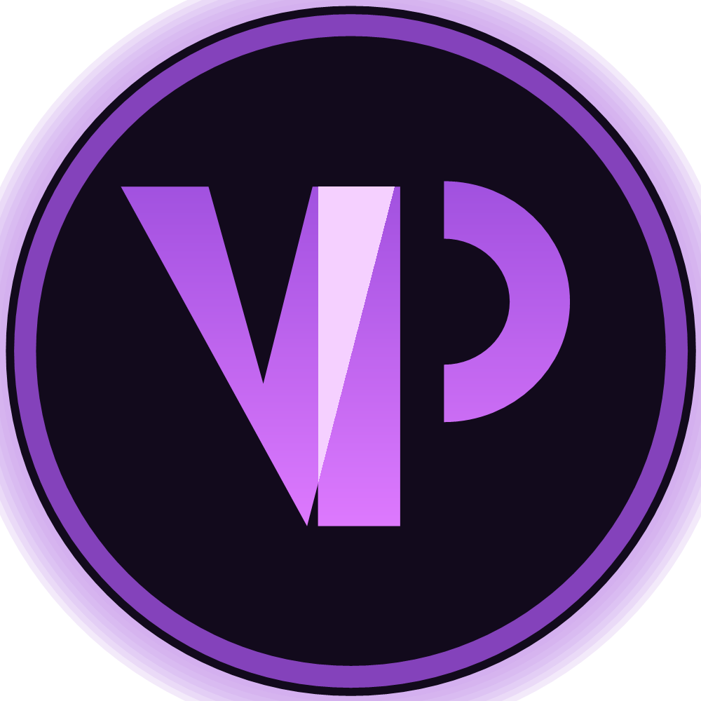
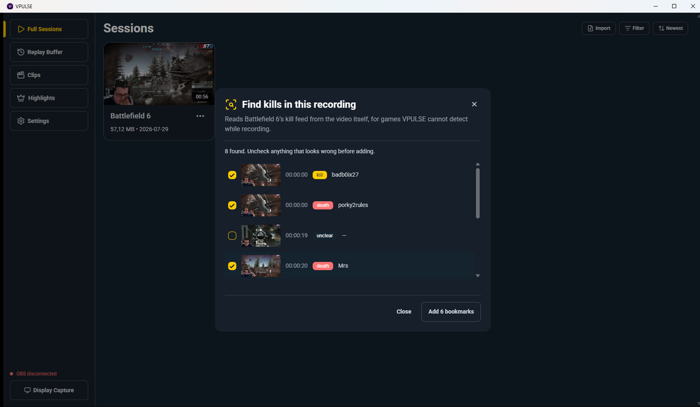
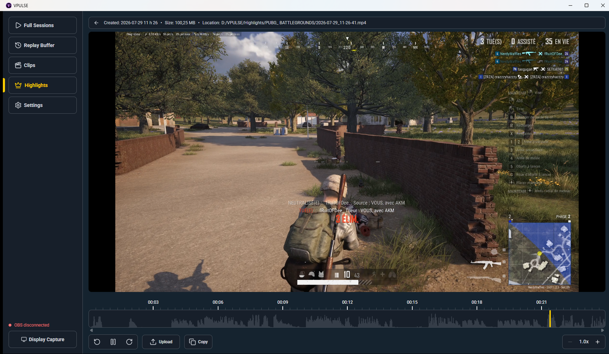
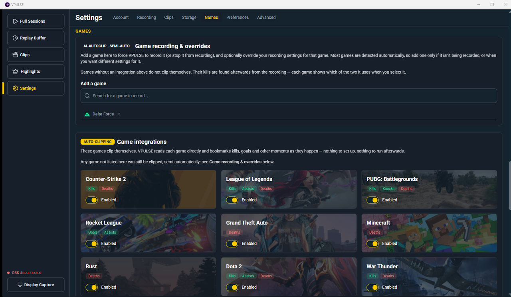
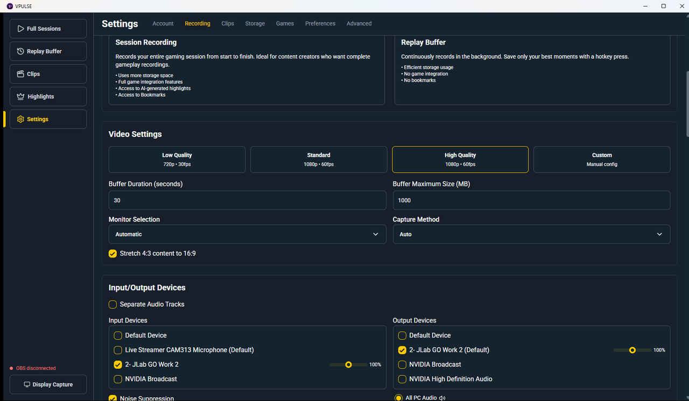

**VPULSE** records your gameplay and finds the moments worth keeping. It runs on Open Broadcaster
Software, captures at high framerates without getting in the way, and marks your kills as they
happen so you are not scrubbing a two-hour session looking for the one clip you remember.

It is a companion project to **[VPZONE.TV](https://vpzone.tv)** — sign in with your VPZONE account
to carry your membership across. Everything below works signed out, on your own machine.

---

### 🎯 Find kills in any game

Games VPULSE knows are clipped automatically while you play. For the rest — Battlefield 6, Delta
Force, anything with no integration — it reads the kill feed back off the recording afterwards.
Box the feed once, and every later session of that game scans with the same setup.

Each candidate comes with the frame it was found on, so you confirm what actually happened rather
than trusting a label.

### ✂️ Player and timeline

### ⚙️ Two ways to clip, stated plainly

Settings says which mode each game uses and what it marks, so there is no guessing why one game
clips itself and another does not.

---

## ✨ Features

- **Auto-start recording** — begins when your game launches, stops when it closes.
- **Auto-clipping** — Counter-Strike 2, PUBG, League of Legends, Rocket League, GTA, Dota 2, Rust,
  Minecraft and War Thunder are read directly, and kills, deaths, goals and assists are bookmarked
  live.
- **Semi-automatic clipping for everything else** — kills found afterwards by reading the game's
  kill feed. Whether a row is your kill or your death comes from where your name sits in it;
  anything it cannot read that way is listed as unclear and left for you to decide.
- **Shareable game profiles** — a calibrated kill feed region is one JSON file, in relative
  coordinates, so it works at any resolution and on anyone's monitor. Ships with profiles for
  PUBG and Battlefield 6; see [Backend/Games/Profiles](Backend/Games/Profiles).
- **Instant clipping** — save the last moments with a hotkey, without ending the session.
- **AI highlights** — assembles a reel from your bookmarked moments. Runs entirely on your machine.
- **Streamer mode** — if OBS is already streaming, VPULSE records through it instead of capturing
  alongside it, so clips keep your overlays and facecam and cost no second encode.
- **Lightweight** — NVENC/AMD VCE, 4K at up to 144 FPS, minimal impact on the game.

---

## Why "VPULSE"?

**VPULSE** is built to help you **preserve those moments**: the chaotic fun with friends, the clutch
plays, and the wins that deserve their own highlight reel.

> VPULSE is a fork of [Segra](https://github.com/Segergren/Segra) by @Segergren, rebranded and
> maintained by @verticalhost alongside VPZONE.TV.

---

## 🛠 Installation

1. **Download** `VPULSE-win-Setup.exe` from the [latest release](https://github.com/verticalhost/vpulse/releases/latest).
2. **Install** — run the setup.
3. **Configure**
   - Set your recording folder and video quality.
   - Assign hotkeys for clipping.
   - Optionally sign in with VPZONE to carry your membership across.

> **Recording folder:** point it at a folder of its own (`D:\VPULSE`), not a drive root. VPULSE
> enforces a storage limit by deleting its oldest recordings, and it should only ever be counting
> its own.

## 🔄 Uninstallation

1. Open `Windows Settings`
2. Go to `Apps` → `Installed apps`
3. Search for `VPULSE`
4. Click `Uninstall`

## 🤝 Contributing

See [CONTRIBUTING.md](CONTRIBUTING.md) for setup, dependencies, and dev workflow.

The easiest useful contribution is a **kill feed profile for a game VPULSE does not ship one for**.
Calibrate it once in the app, then follow [Backend/Games/Profiles/README.md](Backend/Games/Profiles/README.md)
— it is a single JSON file, and it works for everyone who plays that game.

Also welcome: bug reports, feature ideas, and pull requests.

---

## 📜 License

VPULSE is **GPLv2 licensed**.

---

## 🔐 Code Signing Policy

<table>
  <tr>
    <td></td>
    <td>free code signing on Windows provided by <a href="https://signpath.io/" target="_blank">SignPath.io</a>, certificate by <a href="https://signpath.org/" target="_blank">SignPath Foundation</a></td>
  </tr>
</table>

**Team roles**

| Role      | Person |
|-----------|--------|
| Authors   | @verticalhost |
| Reviewers | @verticalhost |
| Approvers | @verticalhost |

**Privacy**

Recording, clipping, kill detection and highlight generation run entirely on your machine and send
nothing — the kill feed scan reads your recording locally and never uploads it. VPULSE makes three
kinds of network request, and no data leaves your PC except where listed:

- **Game detection data** — downloads a public game list and the recorder runtime. Anonymous,
  read-only, no account involved. These are still served from the upstream Segra CDN; moving them
  to VPZONE infrastructure is planned.
- **Sign-in (optional)** — signing in with VPZONE sends you to `vpzone.tv` and stores a token on
  your PC, encrypted for your Windows account. VPULSE reads your username and whether your VPZ+
  membership is active. Covered by [VPZONE's privacy policy](https://vpzone.tv/privacy).
- **Publishing (optional, not yet enabled)** — publishing a clip uploads that file to Gamefolio.
  Nothing is uploaded unless you press the publish button.

Airplane mode in Settings disables every one of these.

## Star History

<a href="https://www.star-history.com/#verticalhost/vpulse&Date">
 <picture>
   <source media="(prefers-color-scheme: dark)" srcset="https://api.star-history.com/svg?repos=verticalhost/vpulse&type=Date&theme=dark" />
   <source media="(prefers-color-scheme: light)" srcset="https://api.star-history.com/svg?repos=verticalhost/vpulse&type=Date" />
   
 </picture>
</a>

## Acknowledgments

- **[Segra](https://github.com/Segergren/Segra)** by @Segergren — the project VPULSE is forked from.
- **[OBS Studio](https://obsproject.com)**: the backbone of VPULSE's recording engine.
- **[ObsKit.NET](https://github.com/Segergren/ObsKit.NET)**: the modern C#/OBS bridge that powers VPULSE's recording functionality.
- **[FFmpeg](https://github.com/FFmpeg/FFmpeg)**: for video and image encoding.
